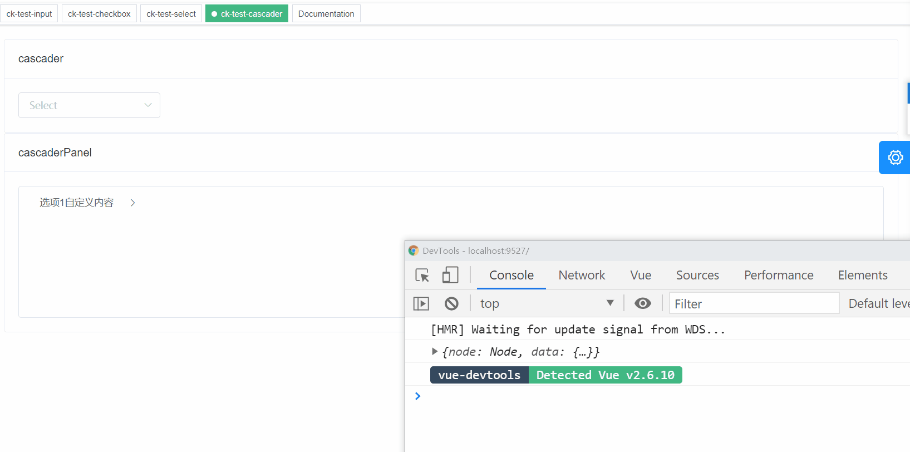

> 组件实现思路文章对应地址： https://juejin.cn/post/6970279201790230541

## 精讲插槽

开始之前写扩展下插槽相关知识

**定义插槽**

简单解释下，Vue内部提供的全局标签`<slot>`供我们写组件的时候提供内置内容来占位，也叫做内容分发

插槽的几种叫法

```html
<slot></slot> // 匿名插槽
<slot name="ck"></slot> // 具名插槽
<slot name="beige" value="插槽传参"></slot> // 作用域插槽
```

> 我们通过插槽传递的参数会被对象包裹，使用的时候就只要从这个对象读取插槽定义的属性就能获取，说白了就是我往这个标签加属性，你使用这个标签的时候可以读取我在这个标签定义的属性

插槽的几种用法

```html
<template slot="beige" slot-scope="{value}"></template> // A
<template v-slot:beige="{value}"></template> // B
<div slot="beige"></div> // C
```

A和B写法是等价的，A那种写法在`2.6.0`版本被v-slot取代了，所以A是个被废弃的写法，你写了也不报错但我也不工作。并且这两张写法只能用于 **template**和**组件**，基于这一点我可以把某个组件当做插槽内容，渲染到当前使用组件的插槽位置

```vue
<ck-a>
	<ck-b v-slot="beige"></ck-b>
</ck-a>
```

> 上面我就把ck-b这个组件当做插槽内容用在ck-a提供的插槽上，所以最终渲染ck-b组件的位置就是ck-a定义slot的位置

C的写法只能用于普通标签上

```html
<p slot="beige"></p>
<h1 slot="beige"></h1>
```

除此之外还有几个小点

- v-slot指令也提供了缩写 `#`，就跟v-on缩写`@`一样
- 插槽可以提供默认内容，当你使用组件但没有去使用我给你写好的插槽的时候，插槽就会解析默认内容 ，就像下面这样

```vue
<template>
  <div class="ck-component">
    <slot name="empty">
    	<div class="empty-node">NO Data</div>
  	</slot>
  </div>
</template>
```

后面我使用这个组件的时候，如果我不写empty插槽的内容，就会默认显示` NO Data`，封装组件的时候很常用

```html
<ck-component>
</ck-component>
```

在组件上下文实例(this)中我们可以通过两个属性来获取插槽

- $slots对象

  1. 只识别不带参数的插槽(也就是不会识别作用域插槽)
  2. 对象里面插槽名称对应的是编译好的VNode数组

- $scopedSlots对象

  1. 所有插槽都识别(匿名、具名、作用域)
  2. 对象里面插槽名称对应的是渲染插槽内容的render函数

$scopedSlots插槽名称对应的是render函数这种设计是更加合理的，所以在Vue3中$slots也设计成了对象里面是渲染插槽内容的render函数

这里用伪代码，描述下使用场景

```html
<template #beige="{ node, data }">
  <span>{{ data.label }}</span>
  <span>自定义内容</span>
</template>

<script>
this.$scopedSlots.beige({
  node: {...},
  data: {...}
})
</script>
```

这种场景在用render函数中会用到，写template的时候Vue在编译的时候已经帮你做好了这件事，这也是深入底层的一些代价。

> 个人认为写render函数能帮助你更好的理解Vue, 本质上template编译成一个渲染，函数中来根据数据对象的写法来描述要渲染的组件内容，Vue再帮你把这些内容渲染成VNode，VNode最终渲染DOM

```js
// template => render => Vnode => Dom
```

## Cascader

支持的类型

- 级联选择框(cascader)
- 级联选择面板(cascaderPanel)

## Attributes

|                    **参数**                    |            **说明**            |                           **类型**                           | **默认值** |
| :--------------------------------------------: | :----------------------------: | :----------------------------------------------------------: | :--------: |
|                value / v-model                 |             绑定值             |                              -                               |            |
|                      type                      |            表单类型            |           `["el-cascader", "el-cascader-panel", ]`           | el-cascade |
|                    options                     |        多选组合框的选项        |                           `Array`                            |            |
|                   optionsUrl                   |          异步获取选项          |                           `String`                           |            |
|          当传入optionsUrl下面参数可选          |                                |                                                              |            |
|                     method                     |            请求方式            | 支持[RESTful-API](http://www.ruanyifeng.com/blog/2011/09/restful.html) |    get     |
|                     params                     | 请求参数(get/post都可以叫这个) |                           `Object`                           |     {}     |
| 支持`el-radio/checkbox/checkbox-group`所有参数 |                                |                                                              |     、     |
|                                                |                                |                                                              |            |


```html
<el-card slot="left" shadow="never" header="cascader">
  <dynamic-cascader
    v-model="cascaderVal"
    :options-url="cascaderUrl"
    :disabled="isDisabledCascaderVal"
    :props="cascaderProps"
    :data="cascaderParams"
    method="post"
  />
</el-card>

<script>
import dynamicCascader from '@/components/common/dynamic-cascader'
export default {
  name: 'CkTestCascader',
  components: {
    'dynamic-cascader': dynamicCascader
  },
  data() {
    return {
      cascaderVal: [],
      cascaderUrl: 'http://mengxuegu.com:7300/mock/6074eb6a56076a4a764847d5/book-components/dynamic-cascader'
    }
  },
  computed: {
    isDisabledCascaderVal({ cascaderVal }) {
      return cascaderVal.length > 2
    },
    cascaderProps({ cascaderVal }) {
      return {
        expandTrigger: cascaderVal.length ? 'click' : 'hover',
        multiple: true
      }
    },
    cascaderParams({ cascaderVal }) {
      return { selectData: cascaderVal }
    }

  }

}
</script>
```

## el-cascader


这是当前组件最初始的形态

```html
<script>
// 供全局使用
let h

// 支持的类型
const cascaderType = [
  'el-cascader',
  'el-cascader-panel'
]

export default {
  name: 'DyCascader',
  // $attrs中的成员不显示在dom上
  inheritAttrs: false,
  props: {
    // 类型
    type: {
      default: 'el-cascader',
      validator: typeVal => {
        return cascaderType.includes(typeVal)
      }
    },

    // 绑定值
    value: {},
    // 备选项
    options: {
      type: Array,
      default: () => []
    },

    // 获取备选项的URL(与options互斥)
    optionsUrl: String,
    method: {
      type: String,
      default: 'GET'
    },
    // 解析接口获取的数据
    parseData: Function,
    
    // 引用el-cascader的ref名称
    refName: String,

    // 支持el-cascader/el-cascader-panel所有参数
  },
  data() {
    return {
      newOptions: this.options
    }
  },
  computed: {
    // 根据method获取params的Key
    paramsObj({getParamsObjByMethod, method, $attrs}) {
      return getParamsObjByMethod({
        method,
        ...$attrs
      })
    },
    // 只要这三个参数有一个变动，就会触发重新计算
    requestOption({ optionsUrl,paramsObj }) {
      return {
        url: optionsUrl,
        ...paramsObj
      }
    },
  },
  watch: {
    requestOption: {
      async handler(requestOption) {
        if (!requestOption.url) return
        this.newOptions = await this.getAsyncOptions({
          requestOption,
          parseData: this.parseData
        })
      },
    },
  },
  methods: {
    // 获取异步数据的参数
    getParamsObjByMethod({method, data, params}) {
      return method.toUpperCase() === 'GET' 
      ? {
        method: 'GET',
        params,
      } 
      : {
        method: 'POST',
        data,
      } 
    },
   
    // 异步获取数据
    async getAsyncOptions({requestOption, parseData}) {
      let request
      if (this.$http) {
        request = this.$http
      }
      // 动态加载axios
      const options = await import('@/utils/request')
        .then(module => {
          request = module.default
          return $request(requestOption)
        })
        .then(res => {
          return parseData && parseData(res) ||
          res.pageData ||
          res.data
        })
        .catch(err => {
          console.error(err)
        })
      return options || []
    },

  },
  render() {
    h = this.$createElement
    const {
      type,
      refName,
      $attrs,
      newOptions,
      renderSlots 
    } = this

    let cascaderVNode = h(type, {
      props: {
        value: this.newValue,
        options: newOptions,
        ...this.$attrs
      },
      on: {
        ...this.$listeners
      },
      ref: refName || 'el-cascader'
    })

    return cascaderVNode
  }
}
</script>
```

可以Get的到的技巧：

1. props接参的时候，通过直接放一个对象我们可以不明确类型来接`value`这个特殊的属性(很多组件库在封装的时候value的类型都是不明确的)

```js
props: {
  value: {}
}
```

- 异步获取数据的时候我们通过异步加载来获取用户配置的axios文件来请求数据(因为用户配置的axios实例有鉴权配置/appID/token等)

```js
require('@/utils/request')
import('@/utils/request')
// 以上两种方式都可以
```

- 什么时候发送的请求啊？我看`created`钩子中压根没写啊？细心的小伙伴可能会发现这行代码

```js
 watch: {
    requestOption: {
      async handler(requestOption) {
        if (!requestOption.url) return
        this.newOptions = await this.getAsyncOptions({
          requestOption,
          parseData: this.parseData
        })
      },
    },
  },
```

这里有个点值得探讨

- watch侦听的requestOptions是一个对象，我们需不需要深度监听呢？

答案是不需要的，因为我侦听的requestOptions是一个计算之后返回的对象，而计算属性requestOptions，依赖的url、method、params只要变动了就会触发重新计算，返回的对象会是一个新的对象(引用地址指向新开辟的内存空间)

## el-cascader-panel

```html
<!-- cascaderPanel -->
<el-card slot="left" shadow="never" header="cascaderPanel">
  <dynamic-cascader
    v-model="cascaderPanelVal"
    type="el-cascader-panel"
    :props="cascaderPanelProps"
  >
    <template v-slot="{ node, data }">
      <span>{{ data.label }}</span>
      <span>自定义内容</span>
    </template>
  </dynamic-cascader>
</el-card>
```



对于作用域插槽的支持，我们在render函数这么写

```js
<script>
  export default {
    render(h) {
      return h('xxx', {
        scopedSlots: {
          default(props) {
            if ($scopedSlots.default) {
              return $scopedSlots.default(props)
            }
          },
        },
      })
    }
  }
<script>
```

